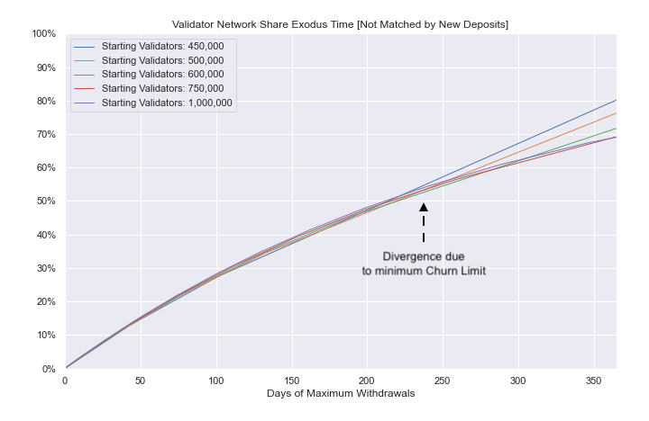

## Ethereum: Mass Validator Exodus

Jupyter Notebook modelling of a mass exodus event of Ethereum validators as per the [Ethereum Consensus Specs](https://github.com/ethereum/consensus-specs/blob/5337da5dff85cd584c4330b46a881510c1218ca3/specs/phase0/beacon-chain.md).

The following situations are examining:
- Maximum rate of withdrawls for a given churn limit
- Maximum rate of withdrawls for an amount of ether staked
- Time to pass a blockage in withdrawal queue based on exiting network share (matched by new deposits)
- Time to pass a blockage in withdrawal queue based on exiting network share (unmatched by new deposits)

## Analysis Limitations

- The analysis was only performed with daily step intervals, not per block. 
- The analysis looks at withdrawals rather than exits.
- The analysis does not account for the `MIN_VALIDATOR_WITHDRAWABILITY_DELAY`.
- The analysis only looks at full withdrawals and considers all exits to be of size = `MAX_EFFECTIVE_BALANCE` (32).